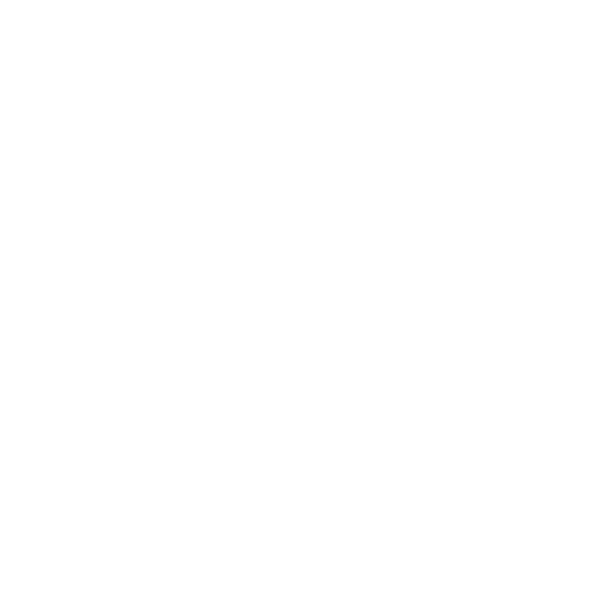

	<h1 align="center">Hi , I'm Maxime Carabina</h1>

  

 

---

 

## 💬 About me:

- 🌱 I'm a developer in training at **Epitech Technology**
####
- 🌍 Fun fact, I like snowboarding !

 

<h2>🧮 Tech Stack</h2>

	 
	<samp>
		

			<a margin="10" href="https://developer.mozilla.org/en-US/docs/Web/HTML" target="_blank">
				
			<a/>
			
			
			
			
		

		

			
			
			
			
			
		

		

			
			
			
			
		

		

			
		

	</samp>

 

<h2>☎️ Contact</h2>

	 
	<samp>
  	

    	 
    	
    	
  	

		

    	
    	 
  	

	</samp>

 

---
